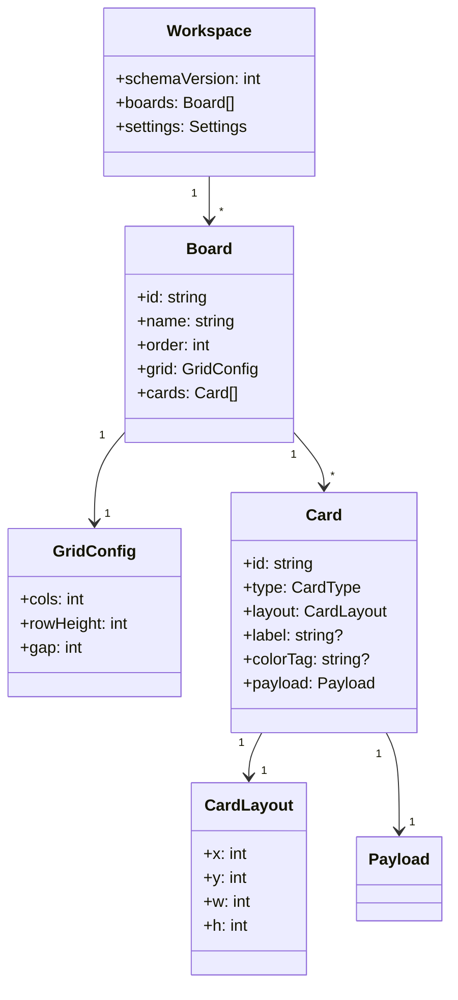
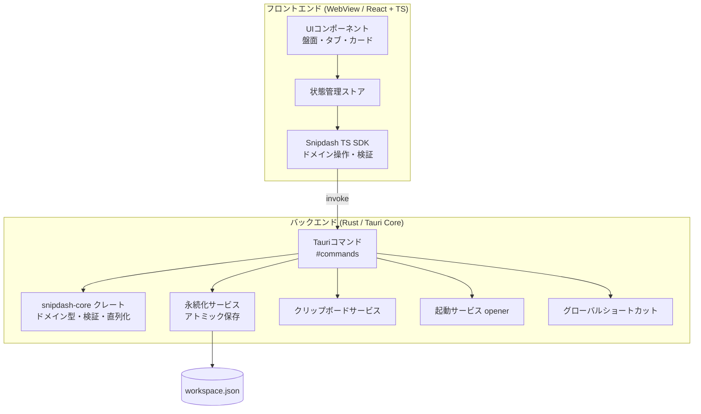
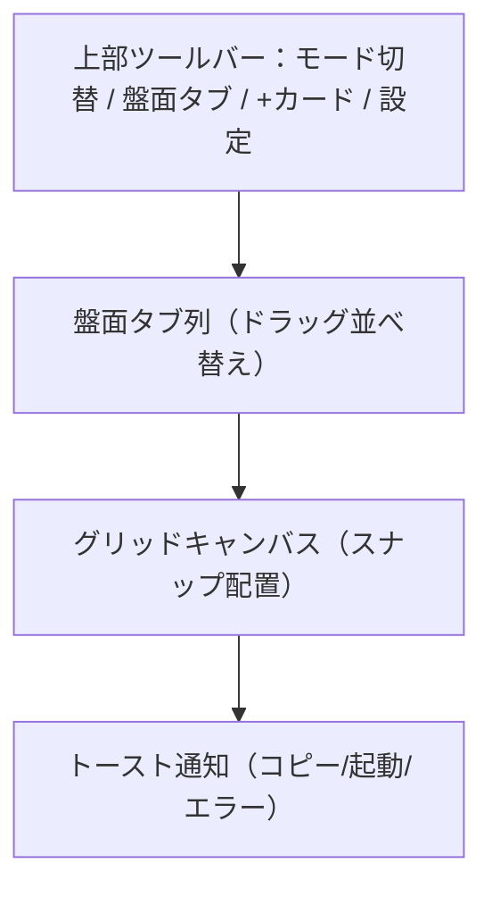

# Snipdash 仕様書（要件定義 → 詳細設計）

> **種別**: OSSデスクトップアプリ（コアは再利用可能な部品として分離設計）
> **コードネーム**: `Snipdash`（= Snippet + Dashboard の仮称。公開前に商標・既存OSS名との重複を要確認）
> **ステータス**: ドラフト v0.1 / 本書で v1 スコープを確定
> **最終更新**: 2026-06-19

---

## 0. このドキュメントの位置づけ

PMとして、ヒアリングで確定した方針をもとに**要件定義から詳細設計まで**を一本化したものです。実装着手時はこの章立てのまま Issue 化できる粒度を意識しています。未確定事項は §15 に集約しています。

### 確定した前提（ヒアリング結果）

| 項目 | 決定 |
|---|---|
| 対応プラットフォーム | Windows + macOS |
| UIモデル | 単一アプリ窓の中にダッシュボード盤面（Metabase寄り） |
| データの性質 | 永続保存（盤面・カードを保存して使い続ける） |
| カード配置 | グリッドにスナップ（整然と並ぶ） |
| v1 必須カード種別 | ①テキストスニペット（編集可＋コピー）②リンク/ファイルパス起動 ③リッチ要素（Markdown・コード・ToDo） |
| 盤面の数 | 複数盤面をタブ/切替で保持 |
| 技術スタック | Tauri（軽量・Rustバックエンド） |
| 同期 | ローカルのみ。データはプレーンなファイルで保存（ユーザーが任意で同期フォルダに置ける） |
| ライセンス | MIT |

---

## 1. プロダクト概要

### 1.1 コンセプト

**「自分で育てる、よく使う断片の作業ダッシュボード」。**
メモ帳の軽さと Notion のブロック表現の中間に位置し、テキスト断片・リンク・ファイル起動などの「よく使うもの」をグリッド上のカードとして並べておき、**ワンクリックでコピー／起動**できる常駐ツール。

### 1.2 解決する課題

- 定型文・コードスニペット・URL・フォルダパスなどを、毎回どこかから探して貼り直している。
- クリップボード履歴ツールは「自動で溜まる」が、**自分が能動的に並べて整理する**用途には向かない。
- Notion は高機能だが起動が重く、クラウド前提で「メモ帳代わりにサッと開く」用途に過剰。

### 1.3 競合調査サマリと差別化（評価：ニッチだが空白あり＝作る価値あり）

| カテゴリ | 代表（無償/OSS） | 代表（有償） | Snipdash との違い |
|---|---|---|---|
| クリップボード管理 | Ditto, CopyQ, Maccy | （多くは無償） | 履歴を**自動収集**する発想。Snipdashは**手動キュレーション**した盤面 |
| スクラッチパッド/メモ | Heynote, Logseq | Notion | **直線的なテキストバッファ**。Snipdashは**空間配置の盤面** |
| デスクトップウィジェット | Rainmeter, Widget Launcher | （Pro拡張が有償） | 情報表示/ランチャー寄りで**コピー元**の発想が薄い |
| Stream Deck型ボタンボード | Macro Deck, Deckboard, OpenDeck | Elgato Stream Deck, TouchPortal | **配信者のマクロ用**・スマホ操作前提。テキスト編集面ではない |

**空白地帯**：4要素を1枚に統合した「ローカル保存・軽量・グリッド自由配置のカードが、編集可能なスニペットのコピー元になり、同時にリンク/ファイル起動も担う作業ダッシュボード」を正面から満たす定番OSSは見当たらない。ここを狙う。

---

## 2. スコープ定義

### 2.1 v1 スコープ（IN）

- 単一アプリ窓のダッシュボード（複数盤面をタブ切替）
- スナップグリッドへのカード配置（追加・移動・リサイズ・削除）
- カード3種：テキストスニペット / リンク・ファイル起動 / リッチ（Markdown・コード・ToDo）
- ワンクリックコピー（テキスト/リッチ）とワンクリック起動（リンク・ファイル）
- 永続保存（ローカルのプレーンファイル、自動保存）
- 使用モード / 編集モードの切替
- 基本設定（テーマ・盤面管理）

### 2.2 v1 スコープ外（OUT、v2以降）

- **画像カード**（コピー/表示）※今回 v1 必須から外れたため v2 優先候補
- 端末間同期（クラウド/アカウント）
- 任意実行ファイルの起動（セキュリティ上、明示確認付きで v2）
- プラグイン/拡張機構
- 自動クリップボード履歴の取り込み
- モバイル対応・Web版

### 2.3 「ソフト or 部品」の両立方針

「OSSソフトもしくは部品」というご要望を踏まえ、**モノレポ構成でコアロジックを独立パッケージ化**する（§9.3）。これにより「完成アプリ」と「再利用可能な部品（Rustクレート＋TS SDK）」を同時に成立させる。

---

## 3. ペルソナ／主要ユースケース

### 3.1 想定ユーザー

- **開発者・運用者**：コマンド断片、接続文字列、よく開くリポジトリ/フォルダ/管理画面URL。
- **サポート/事務**：定型返信文、署名、よく使う社内システムのリンク。
- **一般パワーユーザー**：住所・メアド等の定型、ブックマーク的なファイル/フォルダ起動。

### 3.2 代表ユースケース

1. 盤面「業務定型」を開き、定型文カードのコピーボタンを押して即貼り付け。
2. 盤面「開発」のリンクカードから、よく使うフォルダパスを Explorer/Finder で開く。
3. ToDoカードに当日の作業を箇条書きし、チェックしながら進める（状態は永続化）。
4. 用途別に盤面タブを増やし、使うときだけウィンドウを最前面に呼び出す。

---

## 4. 機能要件（FR）

| ID | 要件 | 優先度 |
|---|---|---|
| FR-01 | ユーザーは盤面（ボード）を作成・リネーム・削除・並べ替えできる | Must |
| FR-02 | 盤面はタブUIで切り替えられる | Must |
| FR-03 | カードをグリッドに追加でき、配置はセルにスナップする | Must |
| FR-04 | 編集モードでカードを移動・リサイズ・削除できる | Must |
| FR-05 | テキストスニペットカードは本文を編集でき、コピーボタンで本文をクリップボードへ送る | Must |
| FR-06 | リンク/ファイル起動カードは、URL・ファイル・フォルダを OS 既定アプリで開ける | Must |
| FR-07 | リッチカードは Markdown / コード / ToDo のいずれかのモードを持つ | Must |
| FR-08 | コード型カードは言語シンタックスハイライトを表示し、生テキストをコピーできる | Must |
| FR-09 | ToDo型カードは項目のチェック状態を永続化する | Must |
| FR-10 | すべての変更は自動保存され、再起動後も復元される | Must |
| FR-11 | 使用モード／編集モードをトグルできる（誤操作防止） | Must |
| FR-12 | コピー/起動の実行時に視覚フィードバック（トースト等）を出す | Should |
| FR-13 | グローバルホットキーでウィンドウを表示/非表示できる | v1.1 |
| FR-14 | ウィンドウの「常に最前面」をトグルできる | v1.1 |
| FR-15 | ライト/ダークテーマを切り替えられる | Should |
| FR-16 | Markdown型カードはプレビュー表示する。生コピーは v1、描画済みコピーは v2 | v1（生）/ v2（描画済み） |
| FR-17 | カードに見出し（ラベル）と色タグを付けられる | Could |
| FR-18 | カードの内容編集（テキスト本文・コード・Markdown・ToDo項目）は**編集モードボタン**を押した時のみ可能。使用モードは閲覧・コピー・起動に限定 | Must |
| FR-19 | テキスト/リッチ（Markdown・コード）の**コピー時に変数を展開**する（例：`{{TODAY}}`→当日日付）。展開は使用モードのコピー実行時に行う | Must |
| FR-20 | 編集モードに**変数挿入ヘルパー**（候補一覧から差し込み）を用意する | Should |

---

## 5. 非機能要件（NFR）

| 区分 | 要件 |
|---|---|
| 軽量性 | 配布物は Tauri により小容量（目標：インストーラ 〜15MB台、常駐メモリ 〜150MB以下）。コールド起動 1.5秒以内を目標 |
| 応答性 | コピー/起動の体感遅延 100ms 以内 |
| 信頼性 | 保存はアトミック書き込み（temp→rename）。クラッシュ時もデータ破損しない |
| 可搬性 | データはプレーンな JSON ファイル。ユーザーが任意で Dropbox/iCloud 等のフォルダに置いて同期可能（公式同期はv1非対応） |
| セキュリティ | Tauri の Capability/Permission で最小権限。任意コマンド実行は不可（§12） |
| プライバシー | 完全ローカル。テレメトリ無し（入れる場合も opt-in・既定オフ） |
| 国際化 | 文言は i18n リソース化。初期は 日本語/英語 |
| アクセシビリティ | キーボード操作・フォーカスリング・適切なコントラスト |
| OS対応 | Windows 10/11、macOS 12+（Apple Silicon / Intel 両対応のユニバーサル） |

---

## 6. 用語・ドメインモデル



- **Workspace**：全データのルート。1ファイルに永続化。
- **Board（盤面）**：タブ1枚に相当。グリッド設定とカード群を持つ。
- **Card（カード）**：グリッド上の1タイル。`type` により `payload` の中身が変わる（タグ付きユニオン）。
- **CardType**：`text` | `launcher` | `rich`（`rich` はさらに `markdown` | `code` | `todo` のサブモード）。

---

## 7. データモデル詳細（永続化フォーマット）

### 7.1 保存場所（OS標準のアプリデータ領域）

| OS | パス例 |
|---|---|
| Windows | `%APPDATA%\Snipdash\workspace.json` |
| macOS | `~/Library/Application Support/Snipdash/workspace.json` |

- バックアップ：保存時に `workspace.json.bak` を世代ローテーション（直近3世代）。
- 移行容易性のため**単一JSON**。将来肥大化したら盤面ごとの分割保存に移行（`schemaVersion` で吸収）。

### 7.2 スキーマ（抜粋・TypeScript型で表現）

```ts
type Workspace = {
  schemaVersion: 1;
  settings: Settings;
  boards: Board[];
};

type Settings = {
  theme: "light" | "dark" | "system";
  alwaysOnTop: boolean;
  globalHotkey?: string;        // 例: "CmdOrCtrl+Shift+Space"
  activeBoardId: string;
  locale: "ja" | "en";
};

type Board = {
  id: string;                   // UUID
  name: string;
  order: number;
  grid: { cols: number; rowHeight: number; gap: number };  // 既定 cols:12, rowHeight:40, gap:8
  cards: Card[];
};

type CardLayout = { x: number; y: number; w: number; h: number };  // グリッドセル単位

type Card =
  | { id: string; type: "text";     layout: CardLayout; label?: string; colorTag?: string;
      payload: { body: string; copyFormat: "plain" | "rich" } }
  | { id: string; type: "launcher"; layout: CardLayout; label?: string; colorTag?: string;
      payload: { kind: "url" | "file" | "folder"; target: string; icon?: string } }
  | { id: string; type: "rich";     layout: CardLayout; label?: string; colorTag?: string;
      payload:
        | { mode: "markdown"; source: string }
        | { mode: "code"; language: string; source: string }
        | { mode: "todo"; items: { id: string; text: string; done: boolean }[] } };
```

### 7.3 整合性ルール

- `id` はすべて UUIDv4。`activeBoardId` は存在する `Board.id` を指す。
- `launcher.target` は保存時にトリム。空はバリデーションエラー。
- 読み込み時に未知フィールドは保持（前方互換）。`schemaVersion` 不一致はマイグレーション関数を通す。

---

## 8. アーキテクチャ設計

### 8.1 全体構成（Tauri）



### 8.2 責務分担

- **フロント（WebView）**：描画・グリッド操作・編集UI・状態管理。ファイルI/Oやクリップボード・起動は**直接触らず**、必ずTauriコマンド経由。
- **バックエンド（Rust）**：永続化、クリップボード書き込み、リンク/ファイル起動、グローバルショートカット、ウィンドウ制御。ドメイン検証は `snipdash-core` に集約。

### 8.3 IPC（Tauriコマンド）一覧

| コマンド | 入力 | 出力 | 備考 |
|---|---|---|---|
| `load_workspace` | – | `Workspace` | 起動時。無ければ初期ワークスペース生成 |
| `save_workspace` | `Workspace` | `Result` | デバウンス保存（§10.3）。アトミック書込 |
| `copy_text` | `{ text }` | `Result` | クリップボードへプレーン書込 |
| `copy_rich` | `{ html, text }` | `Result` | リッチ＋フォールバックのプレーン（任意機能） |
| `open_target` | `{ kind, target }` | `Result` | url/file/folder を OS 既定で開く。検証必須 |
| `set_always_on_top` | `{ enabled }` | `Result` | ウィンドウ制御（v1.1） |
| `register_global_hotkey` | `{ accelerator }` | `Result` | 表示/非表示トグル（v1.1） |

> すべてのコマンドは `Result<T, AppError>` を返し、フロントは失敗をトーストで通知（§13）。
> **テンプレート変数の展開**（§11.4）は新規コマンド不要。`snipdash-sdk` の `resolveTemplate()` でフロント内展開してから `copy_text` に渡す（外部I/O無し）。

---

## 9. 技術スタック選定

### 9.1 確定スタック

| レイヤ | 採用 | 理由 |
|---|---|---|
| シェル | **Tauri 2** | 軽量・OSネイティブWebView・小容量配布・Rustで権限制御が堅牢 |
| バックエンド言語 | **Rust** | Tauri標準。検証・直列化・I/Oを型安全に |
| フロント | **React + TypeScript + Vite**（確定） | グリッドライブラリ成熟度と型安全性。Q1で確定 |
| グリッド | **react-grid-layout** | スナップ/ドラッグ/リサイズの定番。要件と直結 |
| Markdown | markdown-it 等 | 軽量・拡張容易 |
| コードHL/編集 | **CodeMirror 6** | 高品質ハイライト＋編集モードでの軽量エディタを兼ねる（Q3で編集要件あり） |
| 状態管理 | Zustand 等の軽量ストア | ボイラープレート最小 |

> **フロント確定**：Q1の回答により React を採用（Svelteは不採用）。スナップグリッドは react-grid-layout の成熟度を活かす。

### 9.2 Tauri プラグイン

- `tauri-plugin-clipboard-manager`（コピー）
- `tauri-plugin-opener`（URL/ファイル/フォルダを既定アプリで開く）
- `tauri-plugin-fs`（保存先ディレクトリ操作。Capabilityで限定）
- `tauri-plugin-global-shortcut`（任意：表示トグル）

### 9.3 リポジトリ構成（モノレポ：ソフト＋部品の両立）

```
snipdash/
├─ apps/
│  └─ desktop/            # Tauriアプリ（配布物）
│     ├─ src/             # React フロント
│     └─ src-tauri/       # Rust（commands, services）
├─ crates/
│  └─ snipdash-core/      # ★再利用可能な部品（ドメイン型・検証・直列化・マイグレーション）
├─ packages/
│  └─ snipdash-sdk/       # ★TS SDK（型定義・invokeラッパ・検証）
├─ LICENSE                # MIT
├─ README.md
└─ CONTRIBUTING.md
```

`snipdash-core`（Rustクレート）と `snipdash-sdk`（TSパッケージ）を独立公開することで、**他アプリからの再利用＝「部品」**としても成立させる。

---

## 10. フロントエンド詳細設計

### 10.1 画面構成



- **使用モード（既定）**：カードのコピー/起動が主操作。ドラッグ無効でクリック誤爆を防止。
- **編集モード**：カードの移動・リサイズ・追加・削除・本文編集が可能。グリッド線を表示。
- モードは目立つトグル（鍵アイコン）で切替。

### 10.2 主要コンポーネント

| コンポーネント | 役割 |
|---|---|
| `<AppShell>` | ツールバー・タブ・キャンバスの骨格、モード状態保持 |
| `<BoardTabs>` | 盤面の切替/追加/リネーム/並べ替え |
| `<GridCanvas>` | react-grid-layout ラッパ。レイアウト変更を発火 |
| `<CardFrame>` | 共通枠（ラベル・色タグ・編集ハンドル・メニュー） |
| `<TextCard>` | 本文編集＋コピーボタン |
| `<LauncherCard>` | 種別バッジ＋起動ボタン |
| `<RichCard>` | mode に応じ Markdown/Code/Todo を出し分け |
| `<Toast>` | フィードバック表示 |

### 10.3 状態管理と保存フロー

- 単一ストアに `Workspace` を保持。UI操作 → ストア更新 → **300〜500msデバウンス**で `save_workspace` を invoke。
- 保存はバックエンドでアトミック（temp書込→rename、`.bak`ローテーション）。
- 起動時 `load_workspace` → 無ければ「ようこそ」盤面とサンプルカードを生成。

### 10.4 グリッド仕様

- 既定 `cols:12`、`rowHeight:40px`、`gap:8px`。ウィンドウ幅でセル幅が伸縮（rowHeightは固定）。
- カード最小サイズ `w:2,h:2`。重なり禁止（react-grid-layout の衝突回避）。
- 配置はセル単位にスナップ。レイアウト変更時に `layout` を即ストア反映。

---

## 11. カード種別 詳細仕様

### 11.1 テキストスニペット（`text`）

- 本文は複数行プレーンテキスト。**編集は編集モードでのみ可能**（`<textarea>`）。使用モードは読み取り表示。
- **コピーボタン**（使用モード）：本文中の**テンプレート変数を展開**（§11.4）してから `copy_text(resolvedBody)` を実行 → トースト「コピーしました」。
- `copyFormat` 既定 `plain`。`rich`（HTML）は任意機能（将来拡張）。
- エッジ：空本文はコピー不可（ボタン無効化）。

### 11.2 リンク/ファイル起動（`launcher`）

- `kind`：`url`（http/https）/ `file`（既定アプリで開く）/ `folder`（Explorer/Finderで開く）。
- **起動ボタン**：`open_target(kind, target)`。成功/失敗をトースト表示。
- `target` の編集は**編集モードでのみ可能**。
- 表示：種別バッジ＋ラベル（未設定時は target の末尾/ホスト名を簡易表示）。
- **セキュリティ**（§12）：`url` はスキーム許可リスト（http/https/mailto 等）で検証。`file/folder` はパス存在チェック後に既定ハンドラで open。**任意実行ファイルの起動はv1非対応**。

### 11.3 リッチ要素（`rich`）

3サブモードを持つ。サブモードはカード作成時に選択し、後から変更可。**内容編集はいずれも編集モードでのみ**行う。

- **markdown**：`source` を編集（編集モード）／描画プレビュー（使用モード）。コピーは「生Markdown」を基本。コピー時に**変数展開**（§11.4）。描画済みコピーは v2（FR-16）。
- **code**：CodeMirror で `language` 指定のシンタックスハイライト。コピーは生コード（コピー時に**変数展開**）。言語は一般的なものをプリセット＋自由入力。
- **todo**：`items[]` をチェックリスト表示。**チェック切替は使用モードでも可**（状態は即保存）。項目の追加/削除/編集/並べ替えは編集モード。

### 11.4 テンプレート変数（差し込み）★Q3対応

テキスト／リッチ（markdown・code）の本文に `{{...}}` 形式のトークンを埋め込め、**使用モードでコピーを実行した瞬間に展開**してからクリップボードへ送る。保存される本文はトークンのまま（再利用可能）。

**構文**：`{{VARIABLE}}` または `{{VARIABLE:format}}`（フォーマット任意）。`{{` を文字として使いたい場合は `\{{` でエスケープ。

**v1 サポート変数（外部権限不要・安全なものに限定）**

| 変数 | 展開結果 | フォーマット例 |
|---|---|---|
| `{{TODAY}}` | 当日の日付（既定 `YYYY-MM-DD`） | `{{TODAY:YYYY/MM/DD}}`, `{{TODAY:YYYY年M月D日}}` |
| `{{NOW}}` | 現在日時（既定 `YYYY-MM-DD HH:mm`） | `{{NOW:HH:mm:ss}}` |
| `{{TIME}}` | 現在時刻（既定 `HH:mm`） | – |
| `{{YEAR}}` `{{MONTH}}` `{{DAY}}` | 年/月/日（数値） | – |
| `{{UUID}}` | ランダムなUUIDv4 | – |

- **解決タイミング**：コピー実行時（保存時・表示時ではない）。同一トークンが複数あっても1回のコピー内では同じ値で統一（例：`{{NOW}}` は同一瞬間値）。
- **実装場所**：`snipdash-sdk`（フロント）内の純粋関数 `resolveTemplate(text, ctx)`。日付フォーマットは軽量ライブラリ（dayjs等）。外部I/O無しなので追加権限・リスク無し。
- **未知の変数**：展開せずトークンのまま残し、トースト等で軽く警告（誤展開での情報欠落を防ぐ）。
- **編集モードのヘルパー**（FR-20）：変数候補のドロップダウンから本文へ挿入できる。
- **v2候補**：`{{CLIPBOARD}}`（現在のクリップボード内容を差し込み＝クリップボード読取権限が要るため後送り）、カーソル位置トークン、連番・インクリメント変数、ユーザー定義変数。

---

## 12. クリップボード・起動・セキュリティ設計

### 12.1 Tauri Capability（最小権限）

- `fs`：保存先アプリデータディレクトリ**配下のみ**許可（スコープ限定）。任意パス読み書き不可。
- `opener`：`open_target` 経由のみ。フロントから直接任意URL/パスを開かせない。
- `clipboard`：書き込み中心。読み取りは画像カード（v2）導入時に最小限で。
- `global-shortcut`：任意機能としてビルドフラグで切替可能に。

### 12.2 入力検証（バックエンド側で必須）

- URL：許可スキーム（`http`,`https`,`mailto` 等）以外は拒否。`javascript:` 等は明示ブロック。
- ファイル/フォルダ：絶対パス化・存在確認。シンボリックリンク悪用や `..` 経由の意図しない領域参照に注意。
- いずれも**フロントの値を信用せず Rust 側で再検証**。

### 12.3 脅威モデル要点

- ローカル単一ユーザー想定。ネットワーク送信なし（テレメトリ無し）。
- 主リスクは「悪意あるworkspace.jsonの読み込み」→ 起動対象の検証で実害を抑止。共有/同期フォルダ運用時に備え、読み込み時バリデーションを厳格化。

---

## 13. エラー処理・エッジケース

| ケース | 挙動 |
|---|---|
| 保存失敗（権限/ディスク） | トースト＋直近状態をメモリ保持し再試行。`.bak` から復旧導線 |
| 起動対象が存在しない | 「対象が見つかりません」トースト。カードに警告アイコン |
| 不正URLスキーム | 起動拒否＋理由表示 |
| workspace.json 破損 | `.bak` から自動復旧を提案。失敗時は新規作成（破損ファイルは退避保存） |
| schemaVersion 不一致 | マイグレーション実行。失敗時は読み取り専用で表示し移行案内 |
| 盤面0件 | 自動で初期盤面を1枚生成 |
| 巨大テキスト/大量カード | 仮想化・コピーは非同期。UIブロックを避ける |

---

## 14. テスト戦略

| レベル | 対象 | 手段 |
|---|---|---|
| 単体（Rust） | `snipdash-core`：検証・直列化・マイグレーション | `cargo test` |
| 単体（TS） | SDK・ストア・カードロジック | Vitest |
| コンポーネント | 各カード/グリッド操作 | React Testing Library |
| 結合 | Tauriコマンド（保存/コピー/起動） | Rust結合テスト＋モックOS層 |
| E2E | 主要シナリオ（追加→コピー→再起動復元） | tauri-driver / WebDriver |
| 手動 | OS差分（Win/macOS）、起動ハンドラ挙動 | リリース前チェックリスト |

**受け入れ基準（例）**：FR-05/06/10 が両OSで成功。コールド起動・コピー遅延が NFR 目標内。クラッシュ注入後にデータ無損失。

---

## 15. 配布・OSS運用

- **ライセンス**：MIT（`LICENSE` 同梱）。依存ライブラリのライセンス互換を確認（OSS表記を同梱）。
- **配布物**：Windows（MSI/NSIS）、macOS（dmg、ユニバーサル）。署名/公証は将来対応（未署名時の導入手順をREADMEに明記）。
- **CI/CD**：GitHub Actions で Win/macOS マトリクスビルド＋テスト＋リリースドラフト。
- **コミュニティ**：`README`（特徴・スクショ・導入）、`CONTRIBUTING`、`CODE_OF_CONDUCT`、Issueテンプレ、`good first issue` ラベル運用。
- **バージョニング**：SemVer。`schemaVersion` はデータ互換用に別管理。

---

## 16. ロードマップ

| マイルストン | 内容 |
|---|---|
| **v0.1（PoC）** | グリッド＋テキストカード＋コピー＋ローカル保存の最小動作 |
| **v1.0** | 本書 v1 スコープ全体（3カード種別・複数盤面・編集/使用モード・**テンプレート変数差し込み**・両OS配布） |
| **v1.1** | グローバルホットキー/常に最前面の正式化、テーマ、i18n(英語) |
| **v2.0** | **画像カード**（コピー/表示）、Markdownの描画済みコピー、`{{CLIPBOARD}}`・ユーザー定義変数、色タグ/検索 |
| **v2.x** | 任意実行ファイル起動（明示確認付き）、フォルダ分割保存、簡易フォルダ同期支援 |
| **将来** | プラグイン機構、クラウド同期（自前/サードパーティ） |

---

## 17. 確定事項（Q1〜Q6の反映）と残TODO

### 17.1 確定した決定

| # | 論点 | 決定 |
|---|---|---|
| Q1 | フロント | **React + TypeScript + Vite** に確定 |
| Q2 | グローバルホットキー/常に最前面 | **v1.1** に送り（v1.0スコープ外） |
| Q3 | コード/本文の編集と変数 | 基本は閲覧+コピー。**編集モードボタンで編集可**。さらに**`{{TODAY}}` 等のテンプレート変数差し込み**を v1 で実装（§11.4） |
| Q4 | Markdownコピー | v1は**生Markdown**、描画済みコピーは v2 |
| Q5 | サンプル盤面 | 「業務定型 / 開発 / リンク集」の3盤面を初回生成 |
| Q6 | 名称 | 当面 **`Snipdash`** を採用（公開前に商標・重複の最終確認を残す） |

### 17.2 残TODO（実装着手前の軽い確認）

- 日付フォーマット記法（`{{TODAY:...}}`）は dayjs 準拠トークンで確定予定。独自記法が必要なら別途定義。
- 名称の最終確定（商標/既存OSS重複チェック）。
- コードカードの対応言語プリセットの初期セット決定。

---

*本書で v1 スコープが確定しました。次は v0.1 PoC（①グリッド＋カード枠 ②テキストカードのコピー＋変数展開 ③ローカル保存）を Issue 分解して着手できます。*
